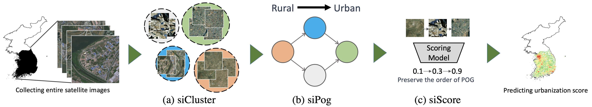
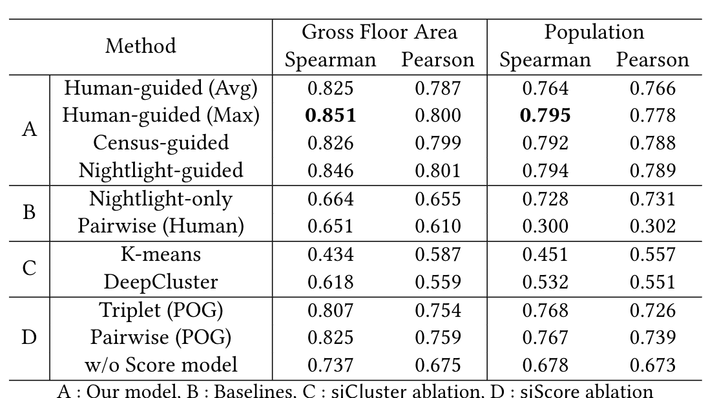

# Learning to score economic development from satellite imagery

Pytorch Implementation of Learning to score economic development from satellite imagery.

## Highlight ##
* We propose a novel model to predict economic development in the absence of ground-truth data. The model only requires the generation of a POG. As we demonstrate in this paper, a POG can be constructed easily using either public online resources or simple human annotation.
* POGs provide an interpretable explanation of which human activity patterns in satellite imagery depict a more significant level of economic development.
* Our approach provides new experimental insights on how to combine human intelligence with machine intelligence.


## Data ##

This research utilized two types of data. One is the demographic information on target areas and the other is the corresponding satellite imagery. Both data types were collected from ArcGIS, which provides a publicly available data repository on maps and geographic information.

Demographic information is called the Esri Advanced Demographics is accessible by the ArcGIS GeoEnrichment Service API.
<li>Visit the ArcGis website <a href="https://doc.arcgis.com/en/Esri-demographics/data/global-intro.htm" rel="nofollow">for a comprehensive set of ready-to-use demographic layers</a></li>
<br>
Satellite images from the tiles of World Imagery
<li>Visit the ArcGis website <a href="https://www.arcgis.com/home/item.html?id=10df2279f9684e4a9f6a7f08febac2a9/" rel="nofollow">for the world and high-resolution satellite and aerial imagery</a></li>


## Required packages ##
The code has been tested running under Python 3.5.2. with the following packages installed (along with their dependencies):

- numpy == 1.15.4
- pandas == 0.23.4
- torch == 1.0.1.post2
- torchnet == 0.0.4
- torchvision == 0.2.2.post3
- scikit-learn == 0.19.1
- xgboost == 0.90

## Model architecture ##
<center> </center>

### Part 1. SiCluster 
* * *
#### siCluster.py 
Training siCluster model with default values of hyper-parameter defined in utils/parameters.py, siCluster_parser().

```
usage: siCluster.py [-h] [--lr LR] [--epochs EPOCHS] [--batch BATCH]
                    [--momentum MOMENTUM] [--seed SEED]
                    [--nmb_cluster NMB_CLUSTER] [--mode MODE]
                    [--pretrained-path PRETRAINED_PATH]

siCluster parser

optional arguments:
  -h, --help            show this help message and exit
  --lr LR               learning rate
  --epochs EPOCHS       number of total epochs to run
  --batch BATCH         mini-batch size
  --momentum MOMENTUM   momentum
  --seed SEED           random seed
  --nmb_cluster NMB_CLUSTER, --k NMB_CLUSTER
                        number of cluster for k-means
  --mode MODE           ("city" or "rural")
  --pretrained-path PRETRAINED_PATH
                        model path
```

##### Example
``` 
$ python3 siCluster.py --nmb_cluster 10 --mode city (cluster for city)
$ python3 siCluster.py --nmb_cluster 10 --mode rural (cluster for rural)
``` 

#### extract_cluster.py 
Extracting cluster of trained siCluster model with default values of hyper-parameter defined in utils/parameters.py, extract_cluster_parser().

```
usage: extract_cluster.py [-h] [--city_model CITY_MODEL]
                          [--rural_model RURAL_MODEL] [--city_cnum CITY_CNUM]
                          [--rural_cnum RURAL_CNUM]
                          [--cluster_dir CLUSTER_DIR] [--histogram HISTOGRAM]
                          [--grid GRID]

extract_cluster parser

optional arguments:
  -h, --help            show this help message and exit
  --city_model CITY_MODEL
                        city cluster model name
  --rural_model RURAL_MODEL
                        rural cluster model name
  --city_cnum CITY_CNUM
                        number of city clusters
  --rural_cnum RURAL_CNUM
                        number of rural clusters
  --cluster_dir CLUSTER_DIR
                        cluster directory name
  --histogram HISTOGRAM
                        cluster histogram name
  --grid GRID           cluster grid info name
```

##### Example
```                  
python3 extract_cluster.py --city_model ckpt_cluster_city.t7 --rural_model ckpt_cluster_rural.t7 --city_cnum 10 --rural_cnum 10
``` 

### Part 2,3. SiPog & SiScore
* * *

#### SiScore.py
Learn to score economic development from POG with default values of hyper-parameter defined in utils/parameters.py, siScore_parser(). 

```
usage: siScore.py [-h] [--lr LR] [--batch-sz BATCH_SZ] [--epochs EPOCHS]
                  [--load] [--modelurl MODELURL]
                  [--pretrained-path PRETRAINED_PATH]
                  [--census-path CENSUS_PATH]
                  [--nightlight-path NIGHTLIGHT_PATH] [--seed SEED]
                  [--lamb LAMB] [--alpha ALPHA] [--mode MODE]
                  [--histogram-path HISTOGRAM_PATH] [--grid-path GRID_PATH]
                  [--dir_name DIR_NAME] [--cluster_num CLUSTER_NUM]
                  [--name NAME] [--graph-name GRAPH_NAME]
                  [--graph-config GRAPH_CONFIG]

siCluster parser

optional arguments:
  -h, --help            show this help message and exit
  --lr LR, --learning-rate LR
                        learning rate
  --batch-sz BATCH_SZ   batch size
  --epochs EPOCHS       total epochs
  --load                load trained model
  --modelurl MODELURL   model path
  --pretrained-path PRETRAINED_PATH
                        model path
  --census-path CENSUS_PATH
                        district information path
  --nightlight-path NIGHTLIGHT_PATH
                        nightlight information path
  --seed SEED           random seed
  --lamb LAMB           lambda parameter for differentiable ranking
  --alpha ALPHA         alpha parameter for differentiable ranking
  --mode MODE           graph inference mode ("census" or "nightlight")
  --histogram-path HISTOGRAM_PATH
                        histogram information path
  --grid-path GRID_PATH
                        grid cluster information path
  --dir_name DIR_NAME   directory name for cluster data
  --cluster_num CLUSTER_NUM
                        number of clusters
  --name NAME           Model name
  --graph-name GRAPH_NAME
                        Graph name
  --graph-config GRAPH_CONFIG
                        graph config path

```

##### Example
```
$ python3 siScore.py --name model_name.ckpt --graph-config human_POG_name.txt --lamb 30 --alpha 4 --cluster_num 21 (for human POG)

$ python3 siScore.py --name model_name.ckpt --mode census --graph-name graph_name.txt --dir_name cluster_kr --histogram-path histogram_kr.csv --lamb 30 --alpha 4 --cluster_num 21 (for census POG)

$ python3 siScore.py --name model_name.ckpt --mode nightlight --graph-name graph_name.txt --dir_name cluster_kr --grid-path grid_kr.csv --lamb 30 --alpha 4 --cluster_num 21 (for nightlight POG)
```
#### extract_score.py
Learn to score economic development from POG with default values of hyper-parameter defined in utils/parameters.py, siScore_parser(). 

```
usage: extract_score.py [-h] [--model MODEL] [--test TEST]

extract_score parser

optional arguments:
  -h, --help     show this help message and exit
  --model MODEL  test model name
  --test TEST    test data name
```

##### Example
```
python3 extract_score.py --model model_name.ckpt --test kr_GFA.csv
```


## Result ##
<center> </center>


